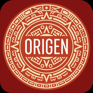

# 🏛️ Museo Origen - App Móvil

<div align="center">
  
  
  ### Museo Moderno de Arte
  *Explora el pasado según tu interés*
</div>

---

## 📱 Descripción

**Museo Origen** es una aplicación móvil Flutter que ofrece una experiencia interactiva para visitantes del Museo Moderno de Arte. La app incluye:

- 🎨 **Exploración por temática** - Descubre colecciones según tus intereses
- 🗺️ **Navegación AR** - Recorre el museo con realidad aumentada
- 🔍 **Búsqueda inteligente** - Encuentra obras por nombre o código
- 👤 **Perfil personalizado** - Guarda favoritos y revisa tu historial

## ✨ Características

### 🎯 Funcionalidades Principales

- **Pantalla de Bienvenida Animada**
  - Logo con animación de entrada
  - Transición suave a login

- **Sistema de Autenticación**
  - Login con usuario/contraseña
  - Recuperación de contraseña
  - Registro de nuevos usuarios

- **Exploración del Museo**
  - Arte Prehispánico
  - Época Colonial
  - México Independiente
  - Arte Contemporáneo
  - Culturas Populares

- **Navegación AR (Simulada)**
  - Indicaciones en tiempo real
  - Visualización de ubicación actual
  - Temporizador de recorrido
  - Controles de zoom y capas

- **Búsqueda Avanzada**
  - Por nombre de obra
  - Por código de catálogo
  - Información detallada de ubicación

- **Perfil de Usuario**
  - Historial de visitas
  - Obras favoritas
  - Configuración de la app
  - Información del museo

### 🎨 Diseño

- **Identidad Visual Única**
  - Paleta de colores terracota y rojo intenso
  - Patrones geométricos prehispánicos
  - Iconografía circular inspirada en calendarios mesoamericanos

- **Material Design 3**
  - Interfaz moderna y accesible
  - Animaciones fluidas
  - Retroalimentación táctil

- **Optimizado para Móviles**
  - Orientación portrait
  - Diseño responsive
  - SafeArea para dispositivos con notch

## 🛠️ Tecnologías

- **Flutter 3.35.4** - Framework multiplataforma
- **Dart 3.9.2** - Lenguaje de programación
- **Material Design 3** - Sistema de diseño
- **Provider** - State management
- **Shared Preferences** - Almacenamiento local

## 📦 Dependencias

```yaml
dependencies:
  flutter:
    sdk: flutter
  cupertino_icons: ^1.0.8
  provider: 6.1.5+1
  shared_preferences: 2.5.3
```

## 🚀 Instalación y Ejecución

### Prerrequisitos

- Flutter SDK 3.35.4 o superior
- Dart SDK 3.9.2 o superior
- Android Studio / VS Code con extensiones de Flutter

### Pasos

1. **Clonar el repositorio**
```bash
git clone <repository-url>
cd flutter_app
```

2. **Instalar dependencias**
```bash
flutter pub get
```

3. **Ejecutar en modo debug**
```bash
flutter run
```

4. **Compilar para web**
```bash
flutter build web --release
```

5. **Compilar APK para Android**
```bash
flutter build apk --release
```

## 📂 Estructura del Proyecto

```
lib/
├── main.dart               # Punto de entrada
├── theme.dart              # Tema y colores
├── splash_screen.dart      # Splash animado
├── login_screen.dart       # Autenticación
├── home_screen.dart        # Pantalla principal
├── explore_screen.dart     # Exploración temática
├── map_screen.dart         # Navegación AR
├── search_screen.dart      # Búsqueda de obras
└── profile_screen.dart     # Perfil de usuario

assets/
├── icon/
│   └── app_icon.png        # Ícono de la app
└── images/                 # Imágenes adicionales
```

## 🎨 Paleta de Colores

| Color | Hex | Uso |
|-------|-----|-----|
| Rojo Primario | `#B33333` | Fondo principal, headers |
| Naranja Acento | `#D87234` | Botones de acción, CTA |
| Crema | `#FFF5E6` | Tarjetas, inputs |
| Rojo Oscuro | `#8B2020` | Patrones de fondo |
| Verde Navegación | `#7A9B5C` | Barra inferior |
| Gris Iconos | `#9E9E9E` | Iconos inactivos |

## 🧪 Testing

```bash
# Ejecutar tests unitarios
flutter test

# Ejecutar tests de widgets
flutter test test/widget_test.dart
```

## 📱 Capturas de Pantalla

### Flujo Principal
1. **Splash Screen** → Logo animado con patrón prehispánico
2. **Login** → Autenticación con diseño culturalmente inspirado
3. **Home** → Opciones principales de navegación
4. **Explorar** → Temáticas del museo
5. **Mapa AR** → Navegación interactiva
6. **Búsqueda** → Encuentra obras específicas
7. **Perfil** → Gestión de cuenta y favoritos

## 🔮 Roadmap

### Versión 1.1 (Próxima)
- [ ] Integración con Firebase Authentication
- [ ] Base de datos Firestore para obras
- [ ] Carga de imágenes reales del museo
- [ ] Sistema de QR codes para obras

### Versión 2.0 (Futuro)
- [ ] AR Core / AR Kit para navegación real
- [ ] Audio guías integradas
- [ ] Modo offline completo
- [ ] Multilenguaje (ES/EN/FR)
- [ ] Compartir favoritos en redes sociales
- [ ] Tours virtuales 360°

## 🤝 Contribuciones

Las contribuciones son bienvenidas. Por favor:

1. Fork el proyecto
2. Crea tu feature branch (`git checkout -b feature/AmazingFeature`)
3. Commit tus cambios (`git commit -m 'Add some AmazingFeature'`)
4. Push al branch (`git push origin feature/AmazingFeature`)
5. Abre un Pull Request

## 📄 Licencia

Este proyecto fue desarrollado como demo para el Museo Origen.

## 👥 Autores

- **Desarrollo Flutter** - Implementación completa de UI/UX
- **Diseño Visual** - Basado en mockups del Museo Origen

## 🙏 Agradecimientos

- Museo Origen por la inspiración del diseño
- Comunidad Flutter por las herramientas
- Culturas mesoamericanas por la riqueza visual

## 📞 Contacto

Para más información sobre el museo o la aplicación, visita:
- **Web**: [museo-origen.mx](https://museo-origen.mx) (ejemplo)
- **Email**: contacto@museo-origen.mx (ejemplo)

---

<div align="center">
  <p><strong>Desarrollado con ❤️ usando Flutter</strong></p>
  <p>© 2026 Museo Origen - Todos los derechos reservados</p>
</div>
